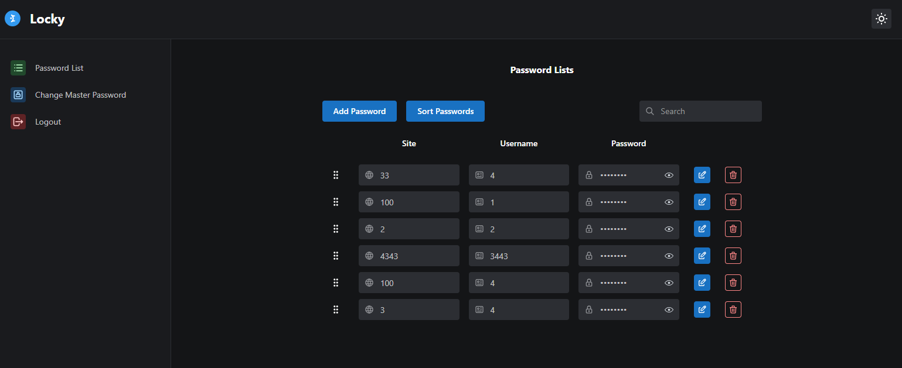

# Read Me

**[Demo](https://password-manager-3f905.web.app/)**

Features:

1. Add, edit and delete passwords
2. prevent duplicated username + site combination passwords
3. drag and drop to reorder passwords
4. sort passwords
5. search passwords
6. change master password
7. logout user upon idle
8. super smooth UX
9. reset all state upon log out
10. API data validation on both ends
11. full API type safety on both ends.
12. Programmatically set env var in Firebase function(with type safety)
13. impossible to use wrong Firebase function name on both end
14. script for prod and dev
15. CI
16. Structured code
17. Standardize Firebase function error handling and logging.
18. Does not log errors in prod environment when processing Master Password to prevent accidentally logging sensitive data. Dev environment log everything.

etc etc

Not only this code demonstrate how to make a password manager, but also how to scale the code and setup project for different environments. The only thing missing is tests.

In practice, you should not commit `functions/.secret/prod.json` file to the repository. This repo is for learning purpose.

Keep in mind if user lost their Master Password, they lose everything. Such mechanic IS A MUST because if you can recover it, it means you can access their site, username and password anytime you want.

Is there any better way to encrypt passwords?

Yes, a better way is client side encryption by using client's device secret. This keep any secret from reaching server at all. (Not demonstrated here)

## Quick Start

1. `npm run reinstall && npm --prefix functions run reinstall`
2. change all the `REACT_APP_xxx` configs in `.github` folder to your own configs, you can use same config for both
3. backup `.github` folder to other folder.
4. `firebase init` setup Github Action deploys
5. copy the `firebaseServiceAccount` and `projectId` from the new `.github` folder to backup `.github` folder.
6. Delete the new `.github` folder and move back the back `.github` folder.
7. Change all the `REACT_APP_xxx` configs in `.config` folder to your own configs, you can use same config for both file
8. make sure the default project name in `firebase.json` is correct.

To work in dev:

1. Run `npm run f-d-deploy` to deploy functions to dev.
2. Run `npm run d-start` to start localhost.

To go live:

1. Run `npm run f-p-deploy` to deploy functions to prod.
2. Commit your code, it will deploy hosting to prod.

## Note

1. The scripts automatically sync `functions/src/schema` to `src/scheme` but NOT vice versa, so you should only make change to `functions/src/schema`.
2. You can manually sync it by using `npm run copy`.
