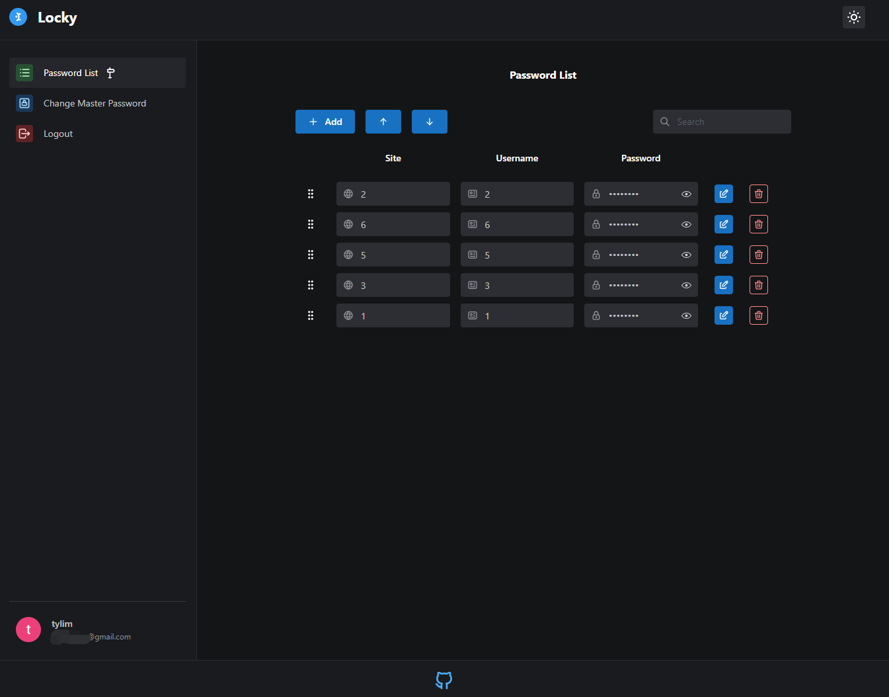

# Client Side Encryption

Features:

1. Add, edit and delete passwords
2. prevent duplicated username + site combination passwords
3. drag and drop to reorder passwords
4. sort passwords
5. search passwords
6. change master password
7. logout user upon idle
8. super smooth UX
9. reset all state upon log out
10. API data validation on both ends
11. full API type safety on both ends.
12. Programmatically set env var in Firebase function(with type safety)
13. impossible to use wrong Firebase function name on both end
14. script for prod and dev
15. CI
16. Structured code
17. Standardize Firebase function error handling and logging.
18. Client side encryption, does not send any sensitive data to server side.

etc etc

Not only this code demonstrate how to make a password manager, but also how to scale the code and setup project for different environments. The only thing missing is tests.

Keep in mind if user lost their Master Password, they lose everything. Such mechanic IS A MUST because if you can recover it, it means you can access their site, username and password anytime you want, your user is not safe from you!

You don't really need to hash master password, because if you failed to decrypt, then it basically means the master password is incorrect. It is just more intuitive to verify master password with hash.

Storing master password hash is also useful if you want to stop user from reusing old master password.

Store anything you want as long as you do not use anything you store in database as encryption key, then your users passwords are safe from you.

Is there any even better way to encrypt passwords?

Yes, a better way is client side encryption by using client's device secret. User don't even need to memorize anything. (Not demonstrated here)

Looking for [server side encryption](https://github.com/tylim88/Password-Manager)? (slower, less safe and much more difficult way of doing stuff)

## Quick Start

1. `npm run reinstall && npm --prefix functions run reinstall`
2. change all the `REACT_APP_xxx` configs in `.github` folder to your own configs, you can use same config for both
3. backup `.github` folder to other folder.
4. `firebase init` setup Github Action deploys
5. copy the `firebaseServiceAccount` and `projectId` from the new `.github` folder to backup `.github` folder.
6. Delete the new `.github` folder and move back the back `.github` folder.
7. Change all the `REACT_APP_xxx` configs in `.config` folder to your own configs, you can use same config for both file
8. make sure the default project name in `firebase.json` is correct.

To work in dev:

1. Run `npm run d-start` to start localhost.

To go live:

1. Commit your code, it will deploy hosting to prod.
